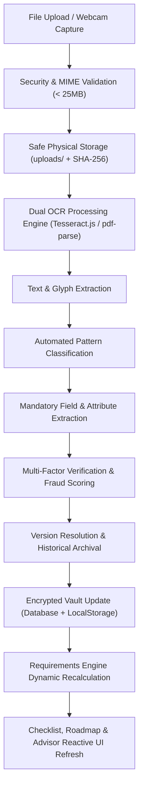

# VerifiQ - Peer-to-Peer & Office Document Verification System

## Running DOCDON authentication

The login API is provided by the Node.js server in `server.js` (`POST /api/auth/session` and `POST /api/auth/register`). For a combined local frontend/backend, run `npm start` and open `http://localhost:3000`.

GitHub Pages serves static files and cannot run this Node.js API. To host the frontend on GitHub Pages, deploy `server.js` and its project files to a Node.js host, then set `apiBaseUrl` in `config.js` to that backend's HTTPS origin (for example, `https://api.example.com`). The backend must allow requests from the frontend origin through CORS. The same configured backend origin is used for login and subsequent API requests. Do not put credentials or secrets in `config.js`.

No `DATABASE_URL` is used; the backend persists its local database files. Set `DOCDON_SESSION_SECRET` to a private, stable secret on the Node.js host so sessions remain valid across server restarts. The server generates an ephemeral secret if this variable is omitted, which invalidates existing sessions when the process restarts.

An empty `apiBaseUrl` uses same-origin API requests. If the account API cannot be reached or does not return a valid session token, login is stopped and no authenticated user is saved or redirected.

## First-time profile setup

After signup, and after any login to an account with an incomplete profile, DOCDON opens `profile.html`. The profile record is stored in the existing `profiles` collection in the backend's JSON database and is keyed by the authenticated user's stable account ID. It stores full name, date of birth, education level, active DOCDON goal, and region; school/college, course, branch, and year/semester are optional academic context for later document checks. A career path is required when the goal is education or career-related. Account email/phone remains the login identifier and is displayed read-only. Gender, photo, and street address are not currently used by the requirements or verification logic.

`GET /api/profile` and `PUT /api/profile` require the session bearer token and always operate on that session's profile; a client-supplied user ID is ignored. The server computes `profileCompleted` and returns `missingFields`. New profiles do not receive shared default personal, education, or document data. Existing built-in demo fixtures remain scoped to their demo accounts. Profile edits are available from the Settings & Profile drawer. No new environment variables or database service are required.

**VerifiQ** is a comprehensive, multi-role identity and document verification web application built directly from the wireframe sketch and product specifications. It supports end-to-end peer-to-peer verification (Person A to Person B), live camera scanning with real-time OCR extraction, biometric identity gates, explicit privacy consent, automated AI verification, manual human review escalation, and office compliance queue management.

---

## 🌟 Key Features & Specification Mapping

### 1. Person A: Requester Portal
- **Create Verification Requests**: Send requests by generating a secure request ID (`REQ-XXXX`) and 4-digit PIN.
- **AI Document Advisor Dialog**: A conversational assistant that interviews the requester to understand their scenario (e.g. *Residential Tenancy*, *Corporate Employment*, *International Visa Clearance*) and automatically prescribes the exact required document checklist.
- **Real-Time Outbound Tracking**: Track pending submissions, inspection progress, and final certification status.

### 2. Person B: Submitter / Document Holder Portal
- **Identity & Biometric Authentication Gate (Addition #2)**: Intended recipient verification via simulated Face Biometrics (liveness match) and 4-digit security PIN before documents can be viewed or submitted.
- **Explicit Consent Sheet (Addition #1)**: Mandatory pre-sharing authorization detailing who is requesting, authorized purpose, 30-day retention period, and restricted access rights.
- **Interactive Camera Scanner**:
  - **Live Webcam Support**: Click *"Live Webcam"* to activate your physical camera (`getUserMedia`) with scanning HUD, laser line, and corner brackets.
  - **High-Fidelity Sample Presets**: 1-click test presets for instant testing (Valid Passport, Near-Expiry Visa, Expired & Blurry License).
- **Dynamic Required Documents Checklist**: Updates in real-time as documents are captured, displaying status badges (`Ready`, `Missing`, `Issues Detected`).
- **Store in App Vault**: Attach pre-stored documents from the internal App Vault as sketched in the notebook.
- **Conditional "Verify" Button**: Only unlocks when all required documents have been scanned and pass basic integrity criteria.

### 3. Verification Engine: "The Golden Flow"
The application implements the complete multi-stage decision pipeline:
1. **AI OCR & Field Extraction**: Optical extraction of Legal Full Name, Document Identifier, Date of Birth, Expiry Date, Issuing Authority, and Readability Score.
2. **Automated Fraud & Expiry Analysis**: Flags documents that are expired, have poor optical clarity, or present name discrepancies.
3. **Smart Escalation**:
   - **High Confidence ($\ge 90\%$)**: Automatically verified.
   - **Uncertain / Edge Cases (e.g. Expiry $< 6$ months, middle initial differences)**: **Escalates to Human Review Officer** rather than immediate rejection.
   - **Critical Failures (Expired, blurry)**: Flagged with explicit failure reasons.
4. **Final Decision & Record**: Immutable cryptographic audit record generated.
5. **Dual Notification Dispatch (Addition #9)**: Both Person A and Person B receive real-time status updates and completion toasts.

### 4. Office / Admin Interface (Compliance Portal)
- **Search Engine**: Search by applicant legal name, request ID, or purpose.
- **Pending Metrics**: Live counter badges for total pending, needs human review, and verified cases.
- **Compulsory Queue Discipline (FIFO Enforcement)**: Implements the notebook rule (*"The Document have to verify compulsory. If the old request not done then don't open further new"*). When toggled on, reviewers must process the oldest case before opening newer ones.
- **Side-by-Side OCR Inspection**: Visual document card compared against extracted structured fields.
- **Emergency / Issue Notice Dispatcher (Addition #4 & Sketch)**: One-click canned issue templates (*Expired Document*, *Name Mismatch*, *Unreadable/Blurry*, *Missing Page*) that immediately display an emergency red alert banner on Person B's screen.

### 5. Trust, Privacy & Audit Additions
- **Verification Badges (Addition #3)**: `✅ Verified`, `⚠️ Needs review`, `❌ Rejected`, `⏳ Pending`.
- **Privacy & Access Control Sheet (Addition #6)**: View access transparency, AES-256 encryption status, auto-purge timers, and instant *"Revoke Access"* button.
- **Cryptographic Audit History Trail (Addition #7)**: Complete immutable timeline of every event, timestamp, and actor.
- **Document Expiry & Validity Warnings (Addition #8)**: Color-coded alerts calculating exact days until expiration (e.g., flagging visas with $< 6$ months validity).

---

## 🚀 How to Run and Test

1. Open `index.html` in any modern web browser (Google Chrome, Microsoft Edge, Mozilla Firefox, or Safari) by double-clicking the file or opening it via your file manager:
   ```
   file:///c:/Users/A/Documents/New folder/index.html
   ```
2. Or serve it using any local static server if desired.

Opening the static demo directly with `file://` keeps account/profile data in the existing browser-local DOCDON database. Use `npm start` and `http://localhost:3000` for the server-backed account/profile system and shared persistent database; new server-backed profiles are stored by backend user ID.

### Testing Scenarios Pre-Loaded:
- **Case 1: David Miller (`REQ-1001`) - Happy Path**:
  1. Switch to **Person B (Submitter)**.
  2. Complete face scan and approve consent.
  3. Scan the remaining documents or test the camera scanner.
  4. Click **Complete & Submit for Verification** to watch the Golden Flow in action.
- **Case 2: Elena Rostova (`REQ-1002`) - Human Review Escalation**:
  1. Switch to **Office / Admin Review**.
  2. Select Elena Rostova. Note that the AI score is $76.8\%$ due to an upcoming visa expiry ($41$ days remaining).
  3. Click **Approve & Certify** or dispatch an **Issue / Emergency Message**.
- **Case 3: Alex Chen (`REQ-1003`) - Emergency Issue Alert**:
  1. Switch to **Person B (Submitter)** and observe the emergency alert banner informing the applicant of their expired license and poor scan clarity.
  2. Switch to **Office / Admin Review** to see reviewer notes and audit history.

---

# DOCDON - AI Document Advisor & Context Intelligence System

DOCDON is an AI Document Advisor and lifecycle document intelligence platform that helps users understand:
- What documents they need across life stages, education paths, jobs, and government processes.
- Which documents they already possess in their encrypted Storage Vault.
- Which required documents are currently missing, expiring, or expired.
- Personalized milestone progression via an interactive visual Document Roadmap.

---

## 🏗️ Persistent User Profile & Context Architecture

The User Profile acts as the single source of truth across DOCDON's backend database, dynamic requirements engine, document vault, and conversational AI advisor.

### User Profile Schema
```json
{
  "userId": "usr-<stable-account-id>",
  "fullName": "<account holder's name>",
  "dateOfBirth": "<YYYY-MM-DD>",
  "purpose": "<selected DOCDON goal>",
  "career": "<selected path when relevant>",
  "educationStage": "<selected education level>",
  "schoolName": "<optional>",
  "course": "<optional>",
  "branch": "<optional>",
  "currentYear": "<optional>",
  "currentDocuments": [],
  "location": "<user-provided state or region>",
  "profileCompleted": true
}
```

### Core Data Fields
| Field | Type | Description |
|---|---|---|
| `userId` | `string` | Stable unique ID from the authenticated account record |
| `purpose` | `string` | Active goal or domain (`career`, `education`, `passport`, `visa`, `renting`, `bank_loan`, `government_work`, `driving_licence`) |
| `career` | `string` | Supported specialization (`engineering`, `mbbs`, `bds`, `pharmacy`, `law`, `ca`, `architecture`) |
| `educationStage` | `string` | Academic completion milestone (`10th_completed`, `12th_pending`, `12th_completed`, `graduate`) |
| `currentDocuments` | `string[]` | Array of canonical document type keys currently stored in the user's Vault |
| `location` | `string` | State or geographic jurisdiction (e.g. `Maharashtra`) for regional reservation and domicile requirements |
| `applicationStage` | `string` | Active phase (`school_admission`, `college_admission`, `entrance_counseling`, `job_application`, `onboarding`) |
| `updatedAt` | `string` | ISO 8601 timestamp of last profile mutation |

---

## 🔌 REST API Endpoints

### 1. User Profile Management
- **`GET /api/profile`**: Retrieves the authenticated user's profile.
- **`PUT /api/profile`** & **`PATCH /api/profile`**: Validates and updates the authenticated user's profile in the existing JSON database.
  - Request body contains profile fields only; account identity is resolved from the session token.
  - Response includes `profileCompleted` and `missingFields` for onboarding state.

### 2. Dynamic Document Requirements
- **`GET /api/requirements`**: Runs the Requirements Engine against the authenticated user's profile and Vault documents, returning:
  - `totalRequired`: Total count of prescribed documents.
  - `availableCount`, `missingCount`, `verifiedCount`, `expiredCount`, `needsReviewCount`.
  - `completionPercentage`: Exact mathematical progress ratio.
  - `requiredDocuments`, `availableDocuments`, `missingDocuments`, `verifiedDocuments`, `expiredDocuments`.
  - `nextRecommendedAction`: Prescriptive guidance on what document to upload or renew next.

### 3. Visual Document Roadmap
- **`GET /api/roadmap`**: Generates the personalized chronological milestone sequence matching the authenticated user's career and education stage:
  - Step 1: 10th Standard Qualifying Milestone.
  - Step 2: 12th Standard Foundation (stream-specific, e.g. PCM for Engineering, PCB for MBBS).
  - Step 3: Entrance Scorecard & Merit Counseling.
  - Step 4: Degree / Professional Certification.
  - Step 5: Onboarding Credentials & Lifetime Archival.

### 4. Conversational AI Advisor
- **`POST /api/advisor/consult`**: Multi-turn dialogue processing that extracts context changes from conversational input (e.g. *"Actually I want MBBS"*) and automatically mutates the backend profile.

---

## ⚡ Dynamic Document Status System

DOCDON maps every prescribed requirement to vault documents using a canonical resolution pipeline with the following states:

1. **`MISSING` (○)**: Required document is not present in the user's Vault.
2. **`AVAILABLE` (✔)**: Document exists in Vault but has not completed formal human certification.
3. **`AI_CHECKED` (🤖)**: Passed automated optical OCR structure verification.
4. **`NEEDS_REVIEW` (⏳)**: Blurry scan, low optical confidence, or partial capture requiring human verification.
5. **`VERIFIED` (🛡️)**: Certified by authorized human compliance officer; **Ready to Share**.
6. **`EXPIRED` (🔴)**: Past validity date; requires renewal before it can fulfill application criteria.
7. **`EXPIRING_SOON` (🟡)**: Within 30-day warning threshold.

---

## 🧪 Verification Walkthrough: Engineering ➔ MBBS Dynamic Switch

This end-to-end scenario verifies profile persistence, reactive recalculation, and UI synchronization:

1. **Initial State (Engineering)**:
   - Profile initialized with `career: "engineering"`, `educationStage: "graduate"`, `currentDocuments: ["aadhaar_card", "pan_card"]`.
   - The Advisor displays Engineering admission requirements:
     - Prescribes 10th Marksheet, 12th Marksheet, Diploma Certificate, B.Tech Provisional Degree, GATE Scorecard, Technical Internship Certificate, and Domicile Certificate.
     - Aadhaar Card and PAN Card show as **Available / Verified**.
     - Engineering credentials and marksheets show as **Missing**.
     - Document Roadmap displays **Engineering B.Tech Path Active**.

2. **User Modifies Career to MBBS**:
   - The user informs the Advisor: *"Actually I want MBBS"* (or triggers `/api/profile` with `career: "mbbs"`).
   - **Backend updates**: Saves `career: "mbbs"` to `database.json` and `data/database.json`.
   - **Requirements Engine recalculates**:
     - Strips B.Tech degree, GATE scorecard, and technical internship requirements.
     - Injects NEET-UG Scorecard, MCC Counseling Allotment Letter, and Medical Fitness Certificate.
     - Recalculates missing documents, available documents, and completion percentage.
   - **Roadmap updates**: Timeline re-renders to **Medical MBBS Path Active** with NEET-UG Counseling milestones.
   - **Instant UI Update**: Checklist and roadmap re-render immediately without a page reload.

3. **Persistence Across Reload & Server Restart**:
   - Refreshing the browser triggers `DOMContentLoaded`, which calls `GET /api/profile`.
   - The backend retrieves the persisted profile (`career: "mbbs"`).
   - The MBBS roadmap, personalized checklist, and vault statuses remain active.
   - Restarting the Node.js backend server preserves the state from `database.json`.

---

## 📥 Real Upload + OCR Automated Pipeline Architecture

DOCDON features a unified, automated single-action intake pipeline. Users upload or scan a document **once**, and the system automatically orchestrates validation, storage, OCR extraction, classification, attribute extraction, verification, vault sync, and dynamic requirements recalculation—with zero requirement for multi-step clicking.



### 1. Dual OCR Architecture (`Tesseract.js` + `pdf-parse`)
- **PDF Documents**: Parsed optically and textually using `pdf-parse` for vector text streams, page catalogs, and metadata tokens.
- **Images (PNG, JPEG, WebP)**: Processed using `Tesseract.js` with neural character recognition, text orientation detection, and confidence scoring.
- **Webcam Real-Time Feeds**: Live video frames from `<video id="storage-scanner-video">` are drawn to an offscreen HTML5 `<canvas>`, rasterized to high-quality JPEG `dataUrl`, and channeled through the identical OCR and verification pipeline.
- **Offline / Degraded Fallback**: If the OCR engine is offline or encountering low clarity, the system adheres to strict **zero-fabrication** rules, escalating the credential to **Needs Human Review** rather than synthesizing fictitious information.

### 2. Random / Unrelated Image Protection
- Unrelated images (e.g., photos of animals, scenery, random graphics, or corrupted files) lack institutional keywords and recognized credential tokens.
- The classifier flags such inputs as `unrecognized`, assigning a minimal score ($8\% - 18\%$) and marking the document as `Needs Human Review` / `Needs Attention`.
- **Zero False-Positive Guarantee**: Unrelated or unverified uploads are never marked as `Verified` or `AI Check Passed`.

### 3. Duplicate Detection & Intelligent Versioning
- When a document of an existing type or title is uploaded, the system:
  1. Detects matching active credentials in the database.
  2. Increments the version number ($v1 \rightarrow v2 \rightarrow vN$).
  3. Preserves previous versions as historical records (`isPreviousVersion: true, versionStatus: 'history', supersededBy: docId`).
  4. Automatically detects whether the upload is a renewal for an expired credential (`isRenewal: true`).
  5. Logs cryptographic audit events tracking version changes.

### 4. End-to-End Pipeline Stages (Single-Action Execution)
1. **Validation**: Enforces strict size checks ($< 25\text{ MB}$), MIME type validation (`application/pdf`, `image/jpeg`, `image/png`), and payload integrity.
2. **Physical Storage**: In Node.js environments, writes the file to `uploads/` with sanitized filenames and computes cryptographic SHA-256 checksums.
3. **Text Extraction**: Optical inspection extracts full text and detected token arrays.
4. **Classification**: Pattern-matching identifies document signatures (Aadhaar, PAN, Passport, Driving Licence, 10th Marksheet, 12th Marksheet, Degree, Resume, etc.).
5. **Field Discovery**: Parses serial identifiers, candidate names, issuing authorities, issue dates, and expiry dates without inventing data.
6. **Multi-Factor Verification**: Evaluates layout fidelity, checksum compliance, expiry status, and cross-matches cardholder names against profile records.
7. **Vault & System Sync**: Dispatches real-time events (`docdon_vault_updated`), updates database records, recalculates user requirements, and refreshes the Dashboard Vault (strictly preserving the 3 most recent documents view), Checklist, and Roadmap.

### 5. Upload REST API Endpoint
- **`POST /api/documents/upload`**
  - **Payload**:
    ```json
    {
      "fileName": "Aadhaar_Original.pdf",
      "fileType": "application/pdf",
      "fileSize": 1048576,
      "fileData": "data:application/pdf;base64,...",
      "documentType": "auto",
      "ownerId": "david.miller"
    }
    ```
  - **Response**:
    ```json
    {
      "success": true,
      "document": {
        "document_id": "doc-1727658900123",
        "title": "Aadhaar Card",
        "document_type": "aadhaar_card",
        "doc_number": "6821 9042 1182",
        "version": 1,
        "current_status": "AI Checked",
        "verification_label": "AI Check Passed"
      },
      "verification": {
        "finalStatus": "AI Check Passed",
        "confidenceScore": 96.5,
        "verificationReason": "Authentic Aadhaar Card issued by UIDAI"
      },
      "ocr": {
        "confidence": 98.2,
        "extractedFields": { "holderName": "David Miller", "docNumber": "6821 9042 1182" }
      },
      "requirements": { "totalRequired": 7, "completionPercentage": 71.4 },
      "checklist": { "totalDocs": 7, "availableCount": 5 },
      "roadmap": { "activeMilestone": "college_university" }
    }
    ```

